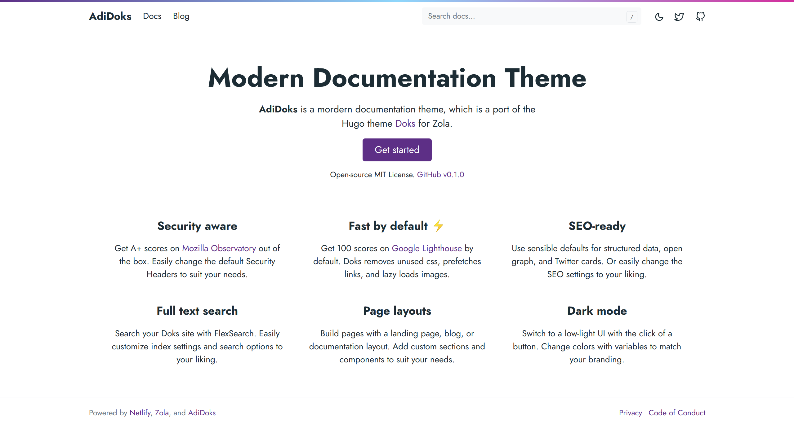

<div align="center">
<h1>📁 Zola Doks</h1>


Zola Doks is an easy way to create documentation for your project.

<a href="https://semanticdata.github.io/zola-doks/">
</a>
</div>

<br />

<div align="center">
  
|  |
| :---: |
</div>

## 🚀 Quick Start

Before using the theme, you need to install [Zola](https://www.getzola.org/documentation/getting-started/installation/) ≥ v0.18.0.

### 1. Clone the repo

```sh
git clone git@github.com:semanticdata/zola-doks.git
```

### 2. Change directory into clone

```sh
cd zola-doks
```

### 3. Serve the site locally

```sh
zola serve
```

For more detailed instructions, visit the [Documentation](https://www.getzola.org/documentation/themes/installing-and-using-themes/) page about installing and using themes.

## 🎨 Customization

You can change the configuration, templates and content yourself. Refer to the [config.toml](config.toml), and [templates](templates) for ideas. In most cases you only need to modify the contents of [config.toml](config.toml) to customize the appearance of your blog. Make sure to visit the Zola [Documentation](https://www.getzola.org/documentation/getting-started/overview/).

<!-- ## 🔄 Changes from Upstream -->

## 💜 Acknowledgements

- Zola Doks is a fork of [Zola Adidoks](https://github.com/aaranxu/adidoks).

## © License

Source code in this repository is available under the [MIT License](LICENSE).
